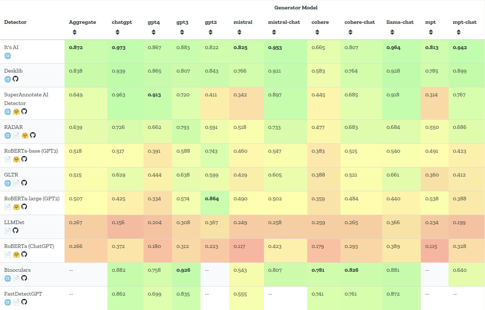

<h1 align="center">
SuperAnnotate  
Generated Text Detection  
</h1>

  

This repository contains the HTTP service for the Generated Text Detector. \
To integrate the detector with your project on the SuperAnnotate platform, please follow the instructions provided in our [Tutorial](tutorial.md)

## How it works ##

### Model ###

The Generated Text Detection model is built on a fine-tuned RoBERTa Large architecture. It has been extensively trained on a diverse dataset that includes internal generation and subset of RAID train dataset, enabling it to accurately classify text as either generated (synthetic) or human-written. \
This model is optimized for robust detection, offering two configurations based on specific needs:

- **Optimized for Low False Positive Rate (FPR):** [AI Detector Low FPR](https://huggingface.co/SuperAnnotate/ai-detector-low-fpr)
- **Optimized for High Overall Prediction Accuracy:** [AI Detector](https://huggingface.co/SuperAnnotate/ai-detector)

For more details and access to the model weights, please refer to the links above on the Hugging Face Model Hub.

## How to run it ##

### API Service Configuration ###

You can deploy the service wherever it is convenient; one of the basic options is on a created EC2 instance. Learn about instance creation and setup [here](https://docs.aws.amazon.com/AWSEC2/latest/UserGuide/EC2_GetStarted.html). \
Hardware requirements will depend on your on your deployment type. Recommended ec2 instances for deployment type 2:
- **GPU**: [**g4dn.xlarge**](https://instances.vantage.sh/aws/ec2/g4dn.xlarge)
- **CPU**: [**a1.large**](https://instances.vantage.sh/aws/ec2/a1.large)

***NOTES***:

- To verify that everything is functioning correctly, try calling the healthcheck endpoint.
- Also, ensure that the port on which your service is deployed (8080 by default) is open to the global network. Refer to this [**tutorial**](https://stackoverflow.com/questions/5004159/opening-port-80-ec2-amazon-web-services/10454688#10454688) for guidance on opening a port on an EC2 instance.

### General Pre-requirements ###

0. Clone this repo and move to root folder
1. **Create SSL sertificate.** It is necessary to create certificates to make the connection secure, this is mandatory for integration with the SuperAnnotate platform. 
- Generate self-signed SSL certificate by following command: `openssl req -x509 -newkey rsa:4096 -keyout key.pem -out cert.pem -days 365 -nodes`
2. **Install necessary dependencies**
- For running as Python file: [***Pyhon3.11***](https://www.python.org/downloads/release/python-3110/)
  - GPU inference: [***Nvidia drivers***](https://ubuntu.com/server/docs/nvidia-drivers-installation) and [***CUDA toolkit***](https://developer.nvidia.com/cuda-12-2-2-download-archive?target_os=Linux&target_arch=x86_64&Distribution=Ubuntu&target_version=22.04&target_type=deb_local)
- For running as Docker: [***Docker***](https://docs.docker.com/engine/install/ubuntu/)
  - GPU inference: [***Nvidia drivers***](https://ubuntu.com/server/docs/nvidia-drivers-installation); [***CUDA toolkit***](https://developer.nvidia.com/cuda-12-2-2-download-archive?target_os=Linux&target_arch=x86_64&Distribution=Ubuntu&target_version=22.04&target_type=deb_local); [***NVIDIA Container Toolkit***](https://docs.nvidia.com/datacenter/cloud-native/container-toolkit/latest/install-guide.html).

### As python file ###

1. Install requirements: `pip install -r generated_text_detector/requirements.txt`
2. Set the Python path variable:
  - `export PYTHONPATH="."`
  - `export DETECTOR_CONFIG_PATH="etc/configs/detector_config.json"`
3. Run the API: `uvicorn --host 0.0.0.0 --port 8080 --ssl-keyfile=./key.pem --ssl-certfile=./cert.pem generated_text_detector.fastapi_app:app`

### As docker containers ###

#### GPU Version ####

1. Build image: `sudo docker build -t generated_text_detector:GPU -f Dockerfile_GPU .`
2. Run container: `sudo docker run --gpus all -e DETECTOR_CONFIG_PATH="etc/configs/detector_config.json" -p 8080:8080 -d generated_text_detector:GPU`

#### CPU Version ####

1. Build image: `sudo docker build -t generated_text_detector:CPU -f Dockerfile_CPU .`
2. Run container: `sudo docker run -e DETECTOR_CONFIG_PATH="etc/configs/detector_config.json" -p 8080:8080 -d generated_text_detector:CPU`

## Performance ##

### Benchmark ###

This solution has been validated using the [RAID](https://raid-bench.xyz/) benchmark, which includes a diverse dataset covering:
- 11 LLM models
- 11 adversarial attacks
- 8 domains

The performance of Binoculars is compared to other detectors on the [RAID leaderboard](https://raid-bench.xyz/leaderboard).

This is a snapshot of the leaderboard for October 2024

### Time performance ###

There are 2 inference modes available on CPU and GPU.
In the table below you can see the time performance of the service deployed in the appropriate mode

| Method | RPS |
|-------:|----:|
|  GPU   | 10  |
|  CPU   | 0.9 |

*In this test, request texts average 500 tokens

## Endpoints ##

The following endpoints are available in the Generated Text Detection service:

- **GET /healthcheck**:
  - **Summary**: Ping
  - **Description**: Alive method
  - **Input Type**: None
  - **Output Type**: JSON
  - **Output Values**:
    - `{"healthy": True}`
  - **Status Codes**:
    - `200`: Successful Response

- **POST /detect**:
  - **Summary**: Main endpoint of detection
  - **Description**: Detection generated text and return report with *Generated Score* and *Predicted Author*
  - **Input Type**: JSON. With string filed `text`
  - **Input Value Example**: `{"text": "some text"}`
  - **Output Type**: JSON. With 2 fileds:
    - `generated_score`: float values from 0 to 1
    - `author`: one of the following string values:
      - *LLM Generated*
      - *Probably LLM Generated*
      - *Not sure*
      - *Probably human written*
      - *Human*
  - **Output Value Example**:
    - `{"generated_score": 0, "author": "Human"}`
  - **Status Codes**:
    - `200`: Successful Response
