# Tutorial: Integrating Generated Text Detection into Your LLM Project #

## Introduction ##

This tutorial guides you through integrating Generated Text Detection into an LLM project on the SuperAnnotate platform. We'll demonstrate how to identify generated text in critical fields of your editor, enhancing data regulation. The HTTP service deployment offers various customization and interaction options with the platform. While we focus on basic detection here, you can tailor this approach to meet your specific needs.

## Pre-requirements ##

Before starting, ensure you have:

1. **SuperAnnotate Account:** Set up a LLM project on the SuperAnnotate platform. If you haven't, follow the instructions [here](https://doc.superannotate.com/docs/create-a-project) to set up a project. \

2. **API Service Configuration:** Configure and launch the API service as described in the [**Readme**](README.md).\
   ***NOTES***:
      - Check the healthcheck endpoint to ensure everything is working correctly..
      - Ensure the service's port (8080 by default) is open to the global network. See this [**tutorial**](https://stackoverflow.com/questions/5004159/opening-port-80-ec2-amazon-web-services/10454688#10454688) for guidance on opening a port on an EC2 instance.

## Setting Up Integration ##

You can integrate detection at any stage of your project, whether starting from scratch or integrating into an existing project. Let's explore both options.

### New Project ###

If you are a new user of SuperAnnotate or want to create a new LLM project with text generation checks, we recommend using our custom template, which looks like this:

From the Annotator's side:
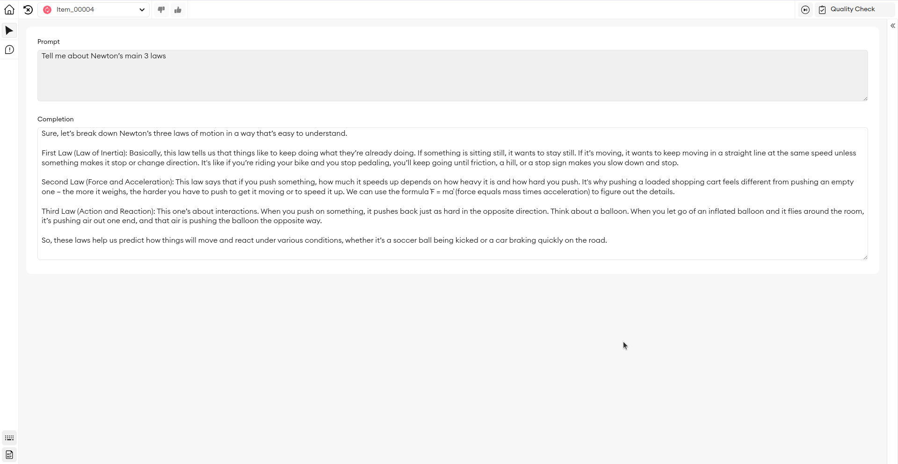

From QA or Admin side:
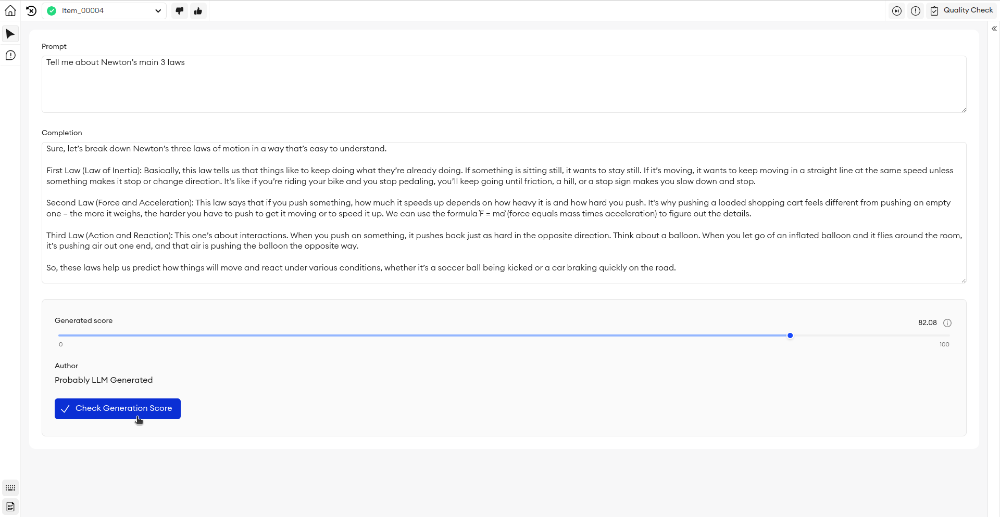

So to import this template follow these steps

1. **Create New `LLMs and GenAI` Project:**
   - Navigate to the main page of your team.
   - Click the `+ New Project` button in the upper right corner.
   - Choose the `LLMs and GenAI` project type from the dropdown list.
   - Name your new project.

   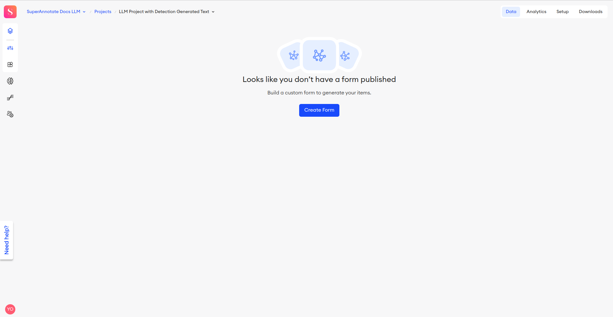

2. **Create Form:**
   - Inside your new project, start by clicking the `Create Form` button.
   - Choose the `New Form` template from predefined templates.
   - To import our prepared form, select `Import` in the upper right corner.
   - Choose `Import JSON` and select the file located in this repository at `etc/template_form.json`.

   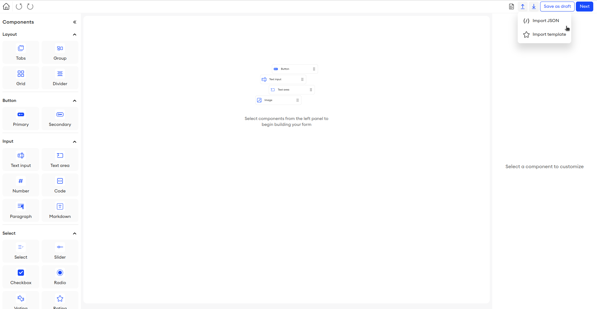

3. **Define Environment Variables:**
   - After importing the form, the form UI should load.
   - Proceed to the next tab by clicking the `Next` button in the upper right corner.
   - Navigate to the `Variables` page, located in the top left corner.
   - Add a new variable named `URL` with the value of your deployed service URL (e.g., "https://\<host\>:\<port\>/").

   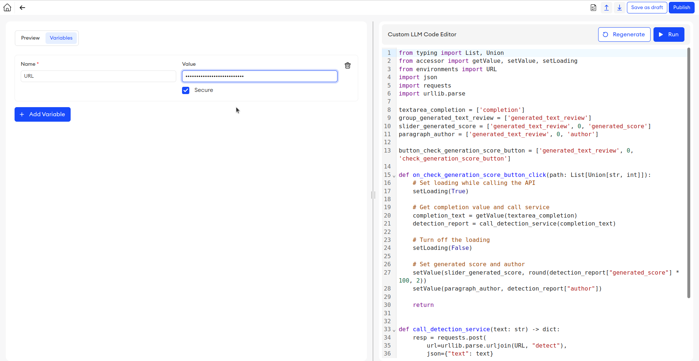

4. **Publish Form and Generate Items:**
   - Click the `Publish` button in the upper right corner.
   - Select a count of items for the test and assign names to them.
   - Press the `Publish and Generate` button.

   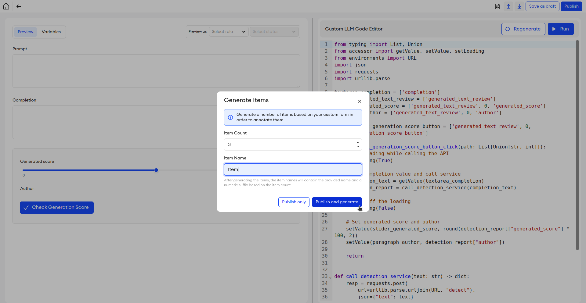

5. **Check Results:**
   - Open the main page with your items and select any item you want to check.
   - Initially, your item will be empty; for the test, you need to fill in at least the `Completion` block.
   - Then, press the `Check Generation Score` button to see the results of the detection on your text.

   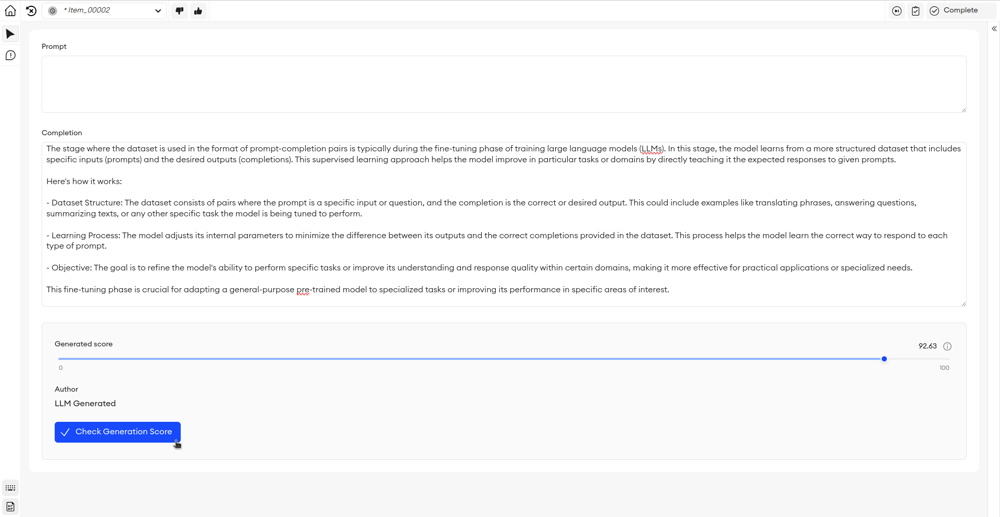

### Existing Project ###  

If you already have an existing project, we recommend adding a "generated_text_review" block to your project’s `Form Builder`, visible only to Admins and QA:

1. **Open `Form Builder`:**
   - Navigate to your project.
   - Click on the `Setup` tab in the upper right corner.
   - Go to `Settings` -> `Editor` in the left menu.
   - Access the `Custom Form Builder`.

   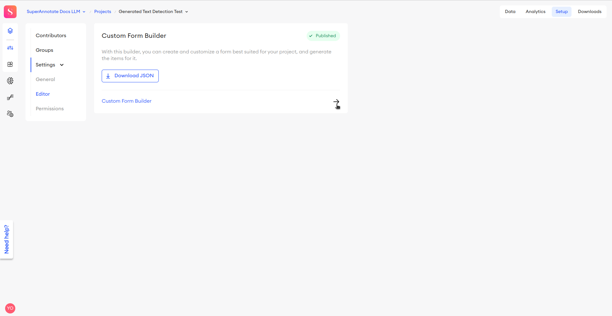

2. **Create `generated_text_review` UI Block:**
   - Drag a `Group` block into your UI form builder (`Components` -> `Layout` -> `Group`).
   - Add the following components inside the group:
      - Slider (`Components` -> `Select` -> `Slider`)
      - Paragraph (`Components` -> `Input` -> `Paragraph`)
      - Primary Button (`Components` -> `Button` -> `Primary`)

   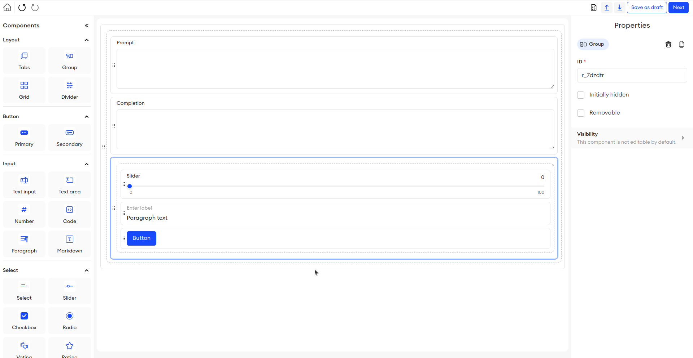

3. **Setting Up `generated_text_review` UI block:**
   - **Group Settings:**
      - Select the created group
      - Set *ID* to "generated_text_review"
      - Hide this group from annotators by adding a visibility condition. `Visibility` -> `+ Add condition`:
         - *Visibility*: `Hidden`; *Role*: `Annatator`; *Statuses*: `All statuses`

      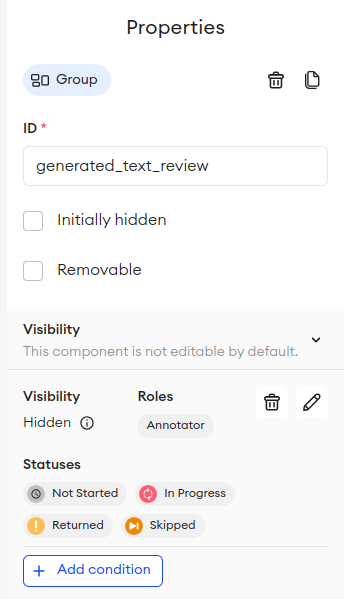

   - **Slider Settings:**
      - Select the slider element
      - Set *ID* to "generated_score"
      - Set *Label* to "Generated score"
      - Enable an info icon with the text "Probability that text was generated by LLM".
      - Choose *Suffix* as persantage **%**

      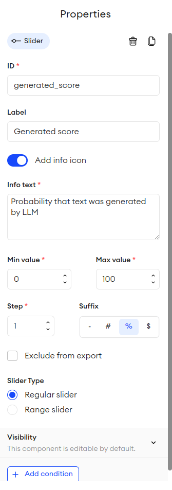

   - **Paragraph Settings:**
      - Select the paragraph element
      - Set *ID* to "author"
      - Set *Label* to "Author"

      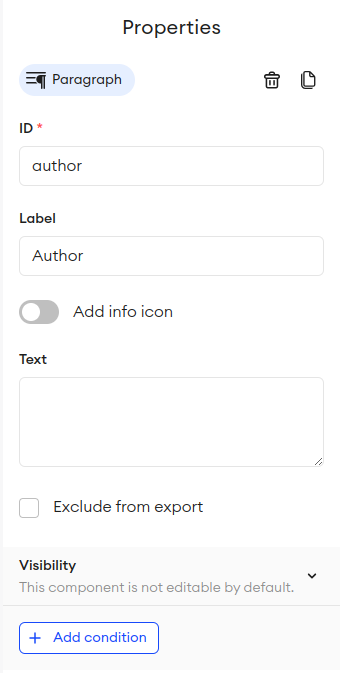

   - **Button Settings:**:
      - Select the button element
      - Set *ID* to "check_generation_score_button"
      - Set *Label* to "Check Generation Score"
      - Set *Icon* to `Check`

      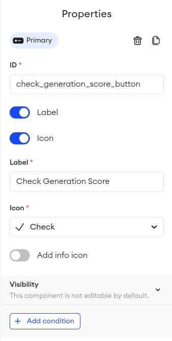

   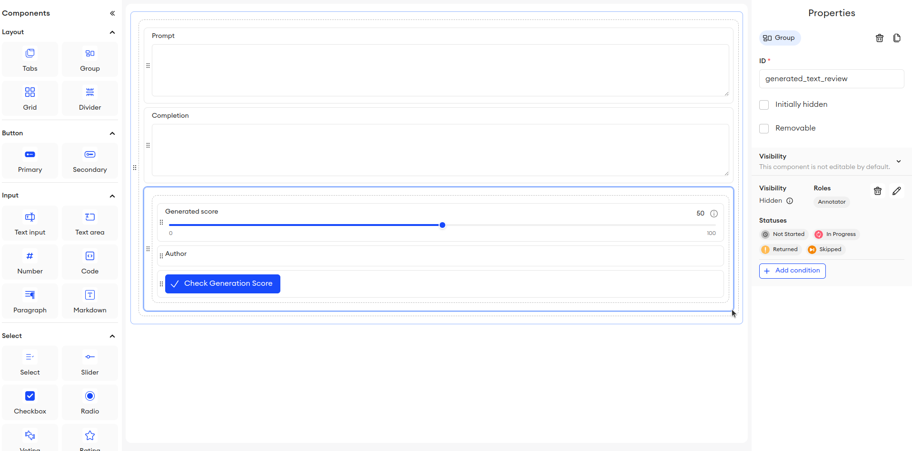

4. **Setting Up `Custom LLM Code Editor`**

   - Define `URL` as an environment variable:
      - Navigate to the `Variables` page. in in the top left corner
      - Add a new variable named `URL` with the value of your deployed service URL (e.g "https://\<host\>:\<port\>/")

      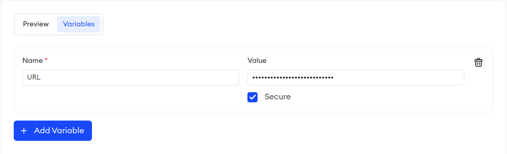

   - Incorporate detection code from the `etc/detection_code_for_editor.py` file in repository to your `Custom LLM Code Editor`.
      - Copy-paste imports block from this file to your `Custom LLM Code Editor`
      > **WARNING**  It is imperative to write in the code exactly your block with the text that you want to check for generativity. Find TODO there (on line 11 of the file) instead of `textarea_completion` you need to pass your variable which is responsible for your text block. My block is like this because in the UI my block has *ID*: "copletion" and in my code there is the following line `textarea_completion = ['completion']`
      - After assigning the desired text element, copy the 2 functions from the repository file to the end of your `Custom LLM Code Editor`
      - After all the code has been copied, you can check the functionality by clicking on the `RUN` button. After that, enter some text into the wahblock with the text to check and click in the UI, click on the `Check Generation Score` button. You should see the generativity score in the slider and paragraph

      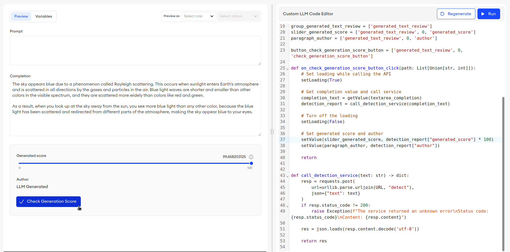

5. **Apply All Changes and Check Results**

   - Update your form builder and UI with the new settings by clicking `update`.
   - Open the main page with your elements and open any element you want to check. The block we created should appear there. Just click on the button and see the result score

   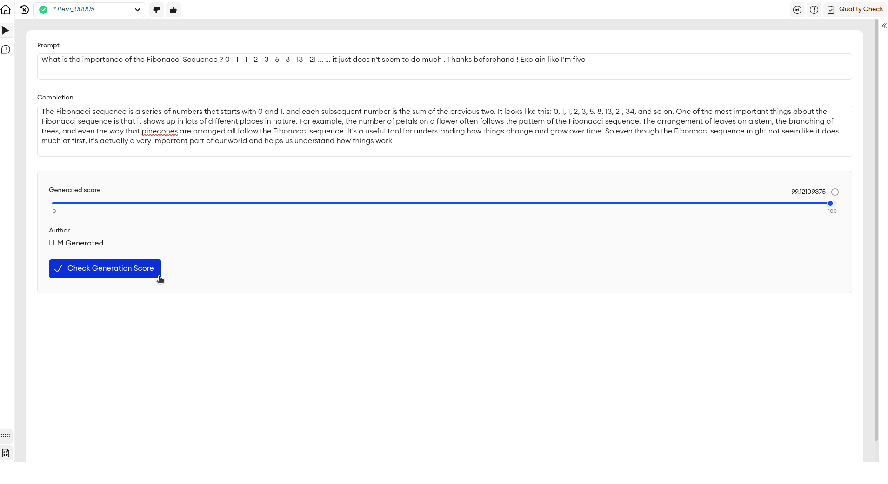
